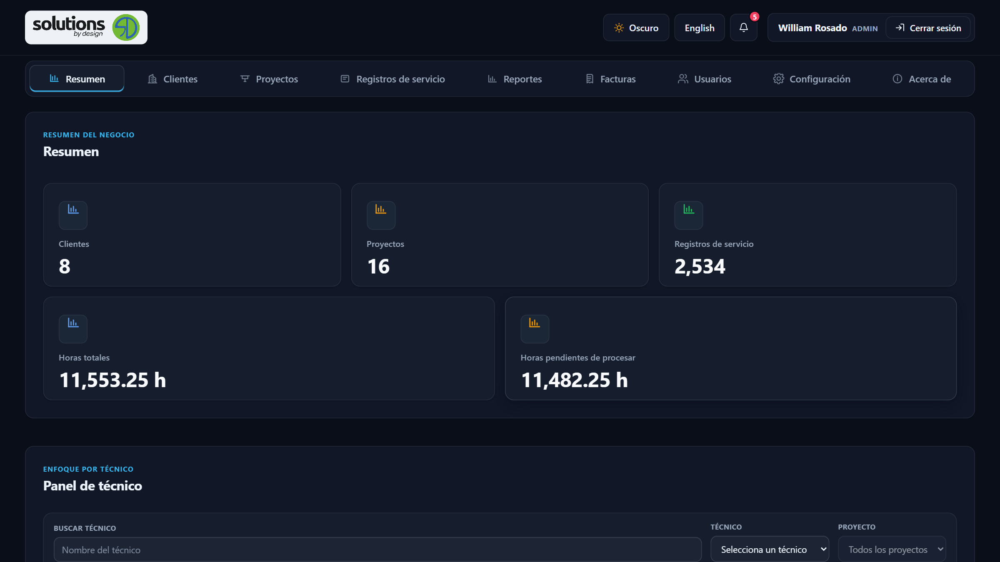
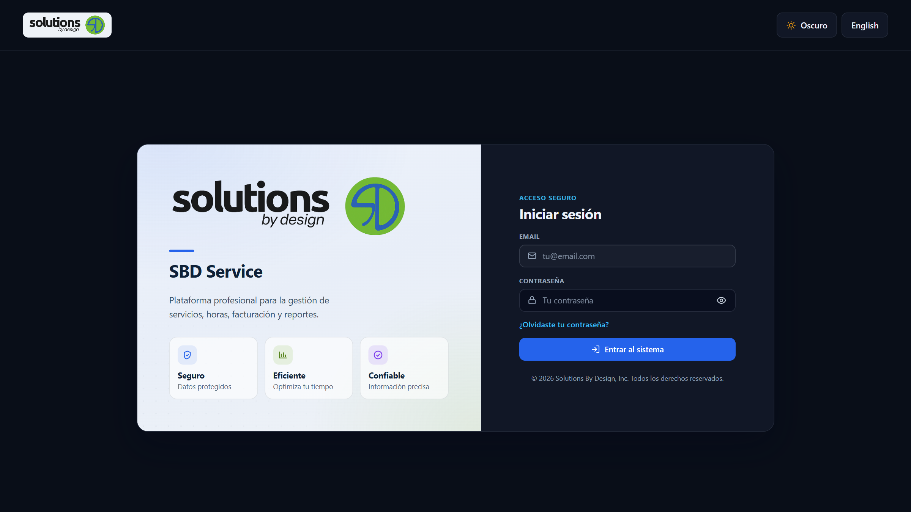
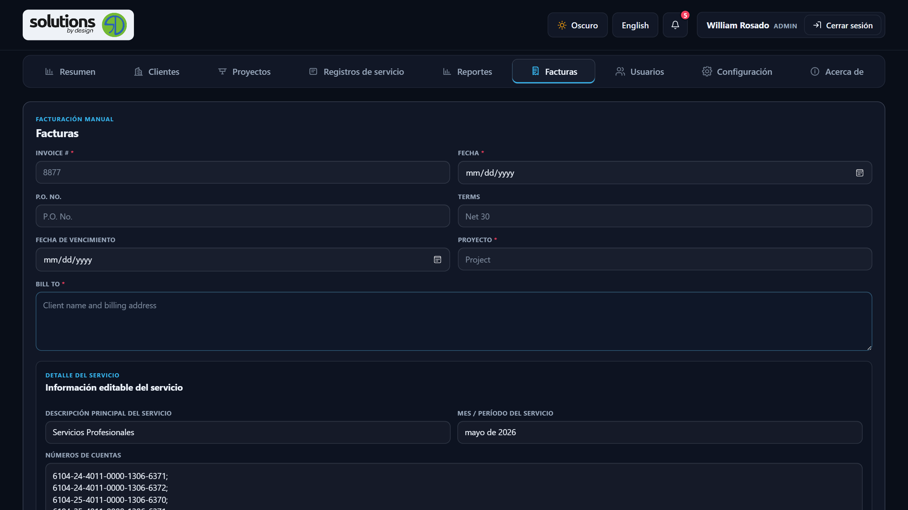
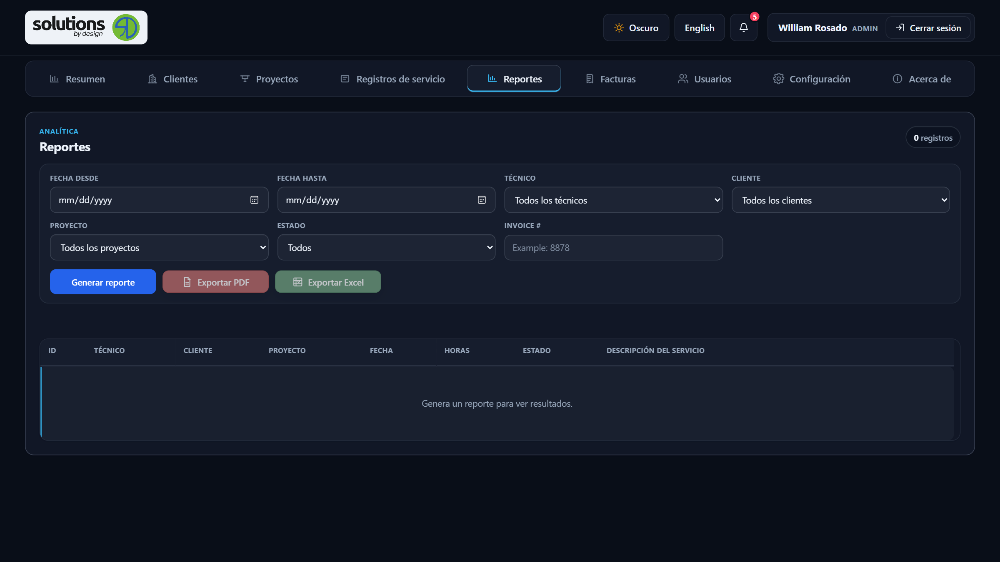
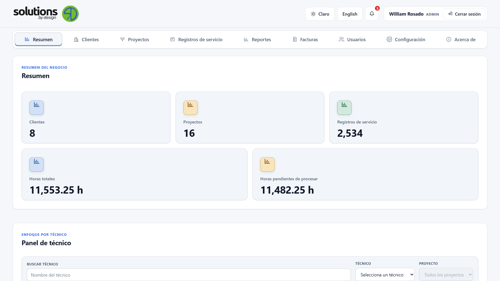
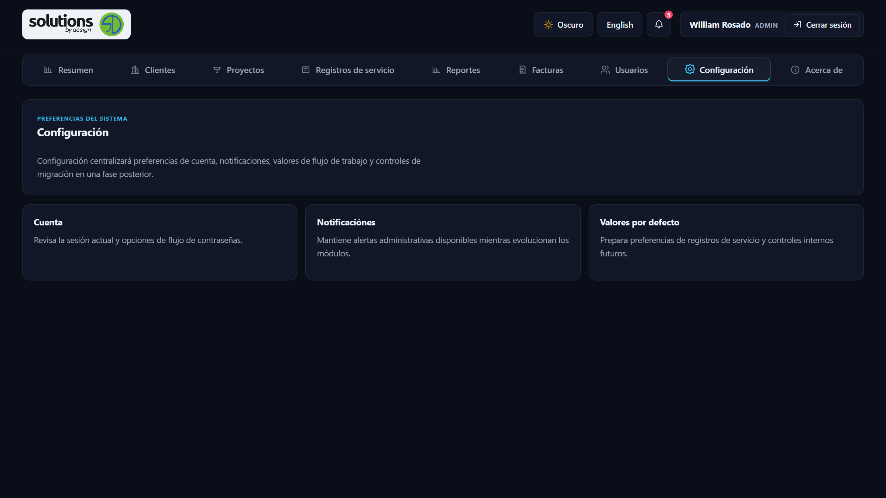
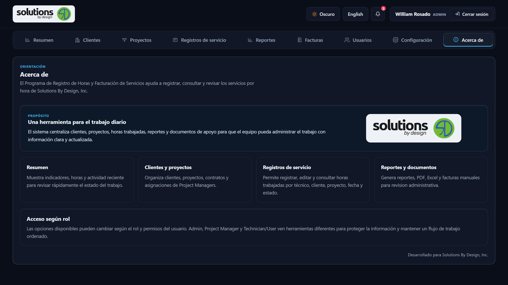

# Solutions By Design — Service Billing System

Language: [English](README.MD) | [Español](README_ES.md)

Solutions By Design, Inc. — Service Billing System is an internal web application
for managing hourly service work: clients and projects, project‑manager
assignments, service records and worked hours, an operational dashboard,
service‑hour reports with PDF and Excel export, and a manual invoice builder
that produces a professional PDF.

The repository name is `Service-Billing-System`. The visible application brand is
`Solutions By Design, Inc.`

---

## Application Preview

Screenshots of the running application (dark theme, 1600×900 desktop). Screens
that display real client or personnel data are documented in text rather than
shown here.



### Main Modules

| Sign in | Manual invoice builder |
| --- | --- |
|  |  |

| Reports | Dashboard — light theme |
| --- | --- |
|  |  |

| Settings | About |
| --- | --- |
|  |  |

---

## Project status

- **Branch:** this version is maintained on **`development`**.
- **Stage:** functional and reviewed visually and by code review during iterative
  development. It is **awaiting formal organizational / user acceptance testing (UAT)**
  before being promoted to `main`.
- **`main` and production have not been updated with this version.** There is no
  release, tag, or deployment associated with this state.
- This document describes the system as currently implemented on `development`. It
  is **not** a statement that the system is production‑ready or fully QA‑certified.

---

## Technology stack

The application is intentionally built without a frontend framework and without a
build step.

| Layer | Technology |
|---|---|
| Frontend | HTML, CSS, vanilla JavaScript (single‑page, no framework) |
| Backend | Node.js, Express |
| Database | Microsoft SQL Server |
| DB driver | `mssql` with `msnodesqlv8` (Windows Authentication by default) |
| Auth / sessions | `express-session`, `bcrypt` password hashing |
| PDF generation | `pdfkit` |
| Excel export | `exceljs` |
| Other | `cors` |

There is **no React, Angular, or Vue** in this version.

---

## Modules and features

### Dashboard (Resumen)

- Business summary with five KPI cards: **Clients, Projects, Service Records,
  Total Hours, Pending Service Hours**.
- KPI cards open a detail panel with the related records (pending hours, processed
  hours, current‑month records, project summary, latest service records).
- Bar‑chart sections for **hours by month, client, project, and technician**,
  rendered without external chart libraries; bars are interactive and open a
  detail panel.
- Recent‑activity panels for service records, clients, and projects.
- **Project panel:** search a project and review its contract details and hour
  totals.
- **Technician panel:** filter by technician, project, and date range to review
  worked hours, hours by client/project, totals, and latest records. Admins can
  select any technician; a technician sees their own scope.
- Company‑wide dashboard data is filtered to active clients, projects, and
  technicians. Numbers use a consistent `en-US` format (for example `11,553.25 h`).

### Clients (Clientes)

- Create, edit, and list clients with search.
- **Active / Inactive** handling via logical (soft) deactivation — rows are never
  physically deleted, so historical information is preserved.
- Fields include contact name, email, phone, billing name, tax ID, and address.

### Projects (Proyectos)

- Create, edit, and list projects linked to a client, with search and a client
  filter.
- **Active / Inactive** logical deactivation.
- Contract information: contract number, contracted hours, used/remaining hours,
  contract start/end dates, and visual contract‑status alerts (OK, low hours,
  expiring soon, exhausted/expired, no contract).
- **Project Manager assignments:** one or more Project Manager users can be
  assigned to a project from the project editor (and from the Users screen).

### Service Records (Registros de servicio)

- List of service records with **server‑side pagination of 50 records per page**
  and Previous / Next navigation with a record counter.
- Search across technician, client, project, and description; filters by
  technician, client, project, service date, and status
  (`Recorded`, `Billed`, `Canceled`).
- Create / edit modal with automatic `TotalHours` calculation from the morning and
  afternoon time ranges `(MorningEnd − MorningStart) + (AfternoonEnd − AfternoonStart)`.
- Logical cancellation (status `Canceled`) — records are not deleted.
- Search input is debounced.
- Role‑ and assignment‑aware: what a user can see and do depends on their role and,
  for Project Managers, their assigned projects.

### Reports (Reportes)

- Service‑hour report with filters: date range, technician, client, project, and
  status; plus a summary (totals, billed/unbilled/canceled hours, breakdowns).
- **PDF export** (PDFKit): a corporate Solutions By Design, Inc. layout with a
  service breakdown and a grouped Time Sheet section, page headers/footers, and
  `Page X of Y` numbering.
- **Excel export** (ExcelJS) for the service‑hour report.
- A manual `Invoice #` field can be included on the exported PDF for the current
  request only; it is not stored in the database.
- Export buttons stay disabled until a report with records has been generated.

### Manual Invoices (Facturas)

A form‑only invoice builder that generates a professional PDF. **No invoice data
from this screen is stored in the database.**

- Editable header: Invoice #, Date, P.O. No., Terms, Due Date, Project, Bill To.
- Editable **Service Detail** section: main service description, service period,
  account numbers, contract number, contract effective dates (native date
  pickers), and contracted / available / worked / final hours.
- Dynamic **invoice lines** with `Quantity`, `Description`, `Rate`, and an
  auto‑calculated `Amount` (`Quantity × Rate`). Lines can be added and removed.
- Summary: **Subtotal**, **IVU** (default rate `11.5%`, can be toggled off or
  changed), and **Total**.
- Optional certification texts (two blocks, each can be shown or hidden in the PDF)
  and two configurable signature blocks (name and title).
- Editable final invoice message.
- `POST /api/manual-invoices/pdf` renders the PDF with all lines, branding,
  metadata, Bill To, totals, certification/signature sections, and page footer.
- **Form validation** before generating: required fields (Invoice #, Date,
  Project, Bill To, and each line's Quantity and Description) show a red `*` on the
  label; on submit, empty/invalid fields get a red border and an inline
  "This field is required." message, `aria-invalid` / `aria-describedby` are set,
  and focus moves to the first invalid field. The error state clears as each field
  is corrected. The account‑numbers field removes exact duplicate lines on load,
  on paste, on blur, and when the PDF is built.

### Users (Usuarios)

- Administrative user management with role and status filters.
- **Active / Inactive** status shown in the table; admins can activate or
  deactivate a user without deleting rows. Inactive users cannot sign in, but
  their historical service records remain available.
- Admins cannot deactivate their own logged‑in account.
- Project Manager assignment management, including a read‑only assignment detail
  view.

### Project Managers

- The `Project Manager` role is limited to the projects assigned to that user
  (stored in `dbo.UserProjectAssignments`).
- Within Clients, Projects, Service Records, Dashboard, and Reports, a Project
  Manager only sees data for assigned projects; PDF/Excel exports use the same
  scope.
- Direct requests for an unassigned project or service record return `403`.
- Project Managers cannot create, edit, cancel, or process service records, and
  cannot access user administration, settings, or the manual‑invoice endpoint.
- A Project Manager with no assignments can still sign in and receives an empty
  scoped workspace.

### Notifications and UX

- In‑app **toast notifications**: success (green), error (red), warning (amber),
  info (blue), with auto‑close, hover‑pause, and a dismiss button.
- A branded **confirmation modal** replaces the browser `confirm()` for
  destructive actions.
- Unsaved‑changes warnings on the main forms; consistent loading states that
  always restore buttons after success or failure.
- Notification bell with unread count; admins can delete individual notifications.
- Password recovery request workflow (`POST /api/forgot-password`); an admin
  resolves the request.

### Theme and UI

- Appearance modes: **System**, **Light**, and **Dark**. The resolved theme is
  applied before first paint to avoid a flash, and the manual preference is
  persisted in `localStorage` under `sbd-theme` (`system` follows the OS).
- Apple‑inspired enterprise UI: hairline borders, subtle elevation, consistent
  radii, calm hover/focus/active states, and reduced‑motion support.
- Responsive layout for desktop, tablet, and mobile.
- Interface text is available in **Spanish and English** through a shared
  translation system, toggled from the header.

---

## Roles and permissions

Roles are defined by the backend implementation. Do not assume permissions beyond
what is listed here.

| Role | Persisted value | Summary |
|---|---|---|
| **Admin** | `Admin` | Full administrative access where implemented: Users, Settings, roles, Project Manager assignments, all Clients / Projects / Service Records / Reports / Dashboard data, and the Manual Invoices screen. |
| **Project Manager** | `ProjectManager` (label "Project Manager") | Read‑oriented access scoped to assigned projects across Clients, Projects, Service Records, Dashboard, and Reports (including exports). Cannot manage users/settings, cannot create/edit/cancel/process service records, cannot use the manual‑invoice endpoint. Unassigned resources return `403`. |
| **Technician / User** | `Technician` or `User` | Authorized service‑record workflow: can view service records and create records under their own technician identity, per the current permission checks. No administrative access. |

Authentication is session‑based with bcrypt‑hashed passwords. Inactive accounts are
blocked at login.

---

## Data and persistence

- Database: **`ServiceBillingDB`** on SQL Server.
- Default connection: server `localhost`, **Windows Authentication**. Overridable
  through environment variables (`DB_SERVER`, `DB_PORT`, `DB_NAME`, and SQL
  credentials when provided).
- Tables used by the application include: `Users`, `Notifications`,
  `PasswordResetRequests`, `Clients`, `Projects`, `ServiceRecords`, `Invoices`,
  `InvoiceLines`, `AppSettings`, and `UserProjectAssignments`.
- Deletions across the app are **logical** (`IsActive = 0` or a `Canceled`
  status). Historical data is preserved.
- The Manual Invoices screen and the Reports `Invoice #` field do **not** write to
  the database.

---

## Installation and running

Prerequisites: Node.js and npm, and a reachable SQL Server instance with
`ServiceBillingDB` available.

```bash
# 1. Install dependencies
npm install

# 2. (Optional) seed demo data if your local schema supports it
npm run seed

# 3. Start the server
npm start

# 4. Open the application
#    http://localhost:3000
```

Environment overrides (optional): `DB_SERVER`, `DB_PORT`, `DB_NAME`,
`APP_ASSET_VERSION`, `PORT`.

---

## Windows launcher

A convenience launcher for local demos is included at
`tools/launcher/service_billing_launcher.py`, with its own documentation in
`tools/launcher/README.md`.

It runs `npm start` from the project folder, waits for `http://localhost:3000`,
opens the default browser, avoids starting duplicate processes, and writes logs to
`tools/launcher/logs/`. It does not modify the database and does not replace the
Node/Express server. It can optionally be packaged into an `.exe` with PyInstaller.

---

## Repository structure

| Path | Purpose |
|---|---|
| `index.html` | Application shell: login, navigation, screens, tables, forms, and modals. |
| `style.css` | Theme system (System/Light/Dark), layout, components, and visual states. |
| `app.js` | Frontend logic: API calls, translations, filters, role‑aware UI, validation, dynamic rendering. |
| `server.js` | Express backend: SQL Server connection, authentication, all module APIs, reports, PDF and Excel generation. |
| `service-billing-schema.sql` | Creates `ServiceBillingDB`, its tables, relationships, indexes, and demo data. |
| `phase-34-project-manager-assignments.sql` | Idempotent migration for the Project Manager role and `UserProjectAssignments`. |
| `seed.js`, `seed-demo-data.js` | Demo data helpers. |
| `assets/` | Logos and favicon assets. |
| `tools/launcher/` | Windows demo launcher and its documentation. |

---

## Testing status

- Modules have been exercised through iterative development and code review, and
  the current UI has been reviewed visually.
- Formal, documented QA and organizational/user acceptance testing across all
  roles, browsers, and data scenarios is **still pending**.
- Until UAT is completed and signed off, this version stays on `development` and
  is not promoted to `main` or deployed.

---

## Author

**William Rosado Pérez** — B.S. Computer Science · IT Support Specialist ·
Database Support · Puerto Rico

GitHub: [https://github.com/Puppywill](https://github.com/Puppywill)
