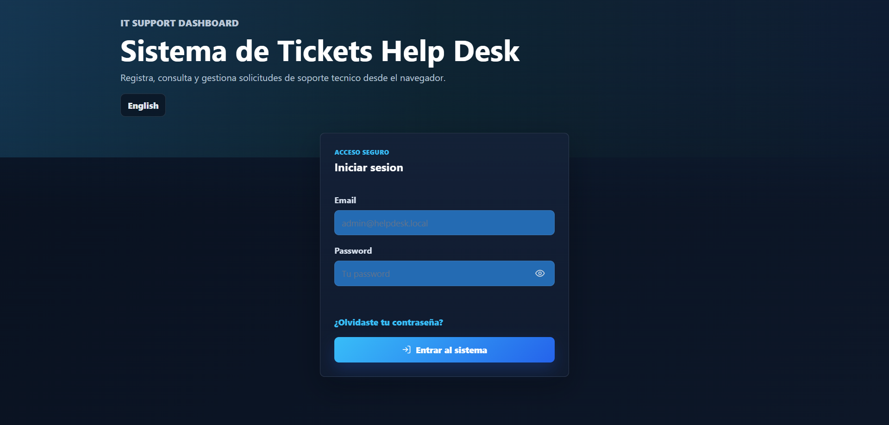
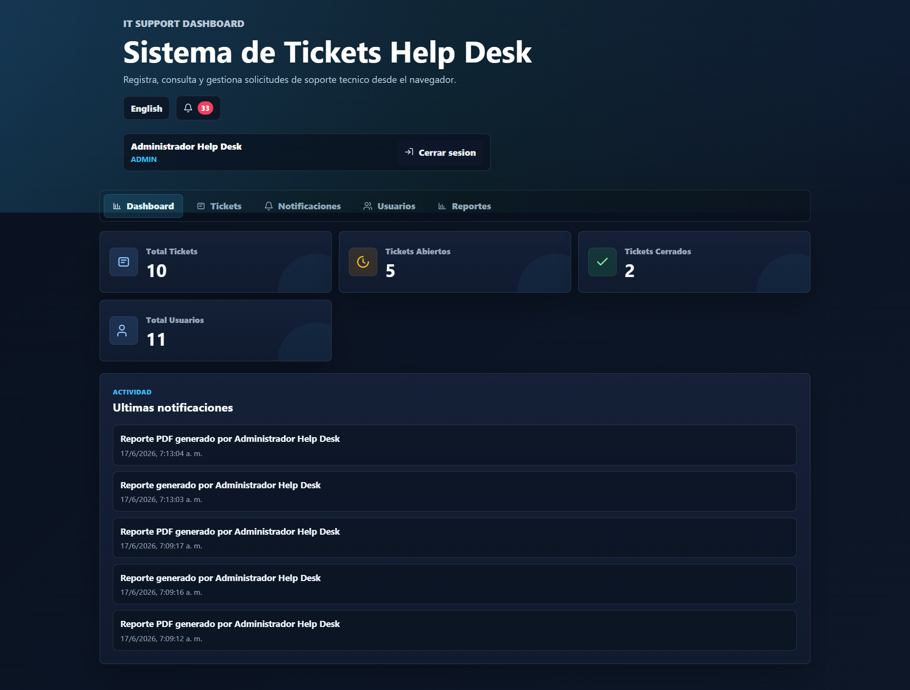
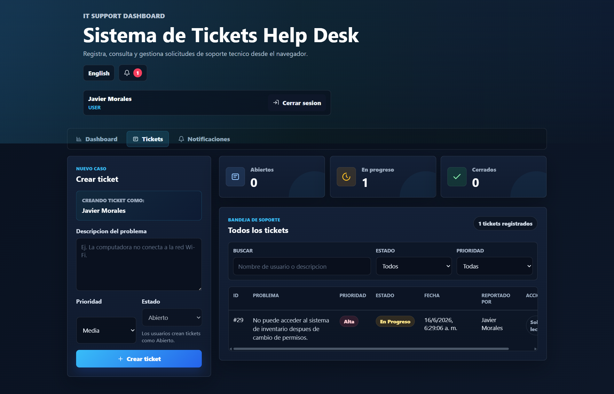
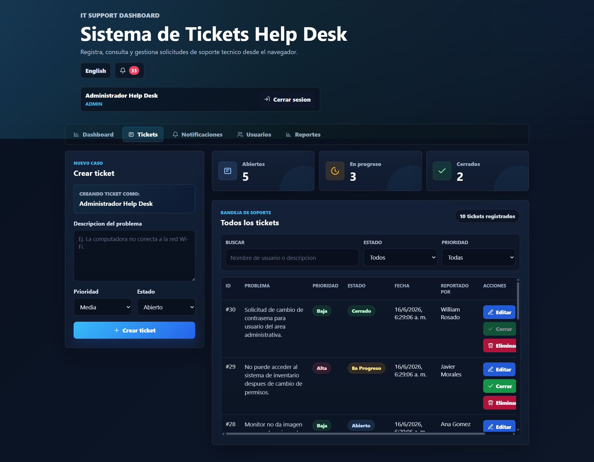
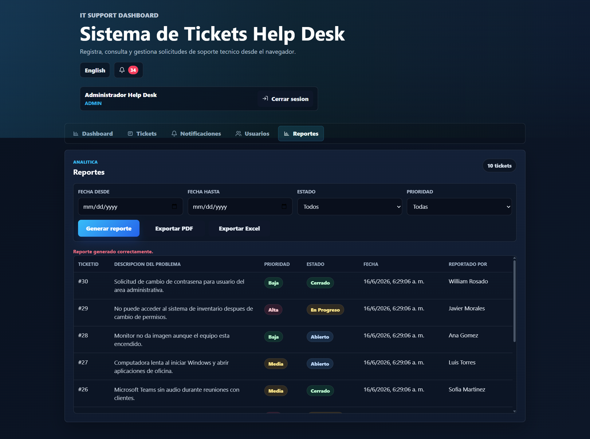
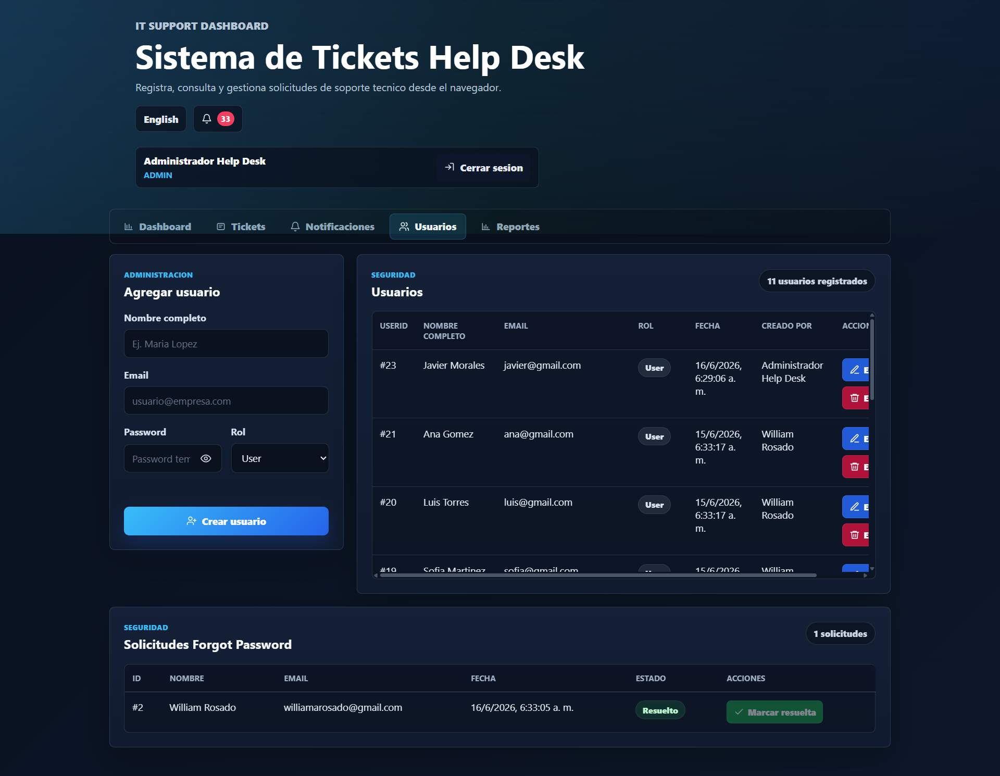
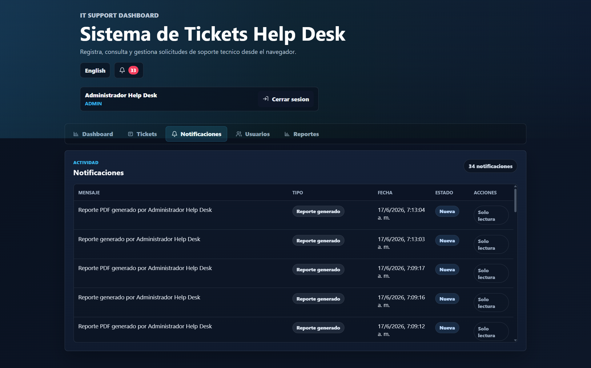
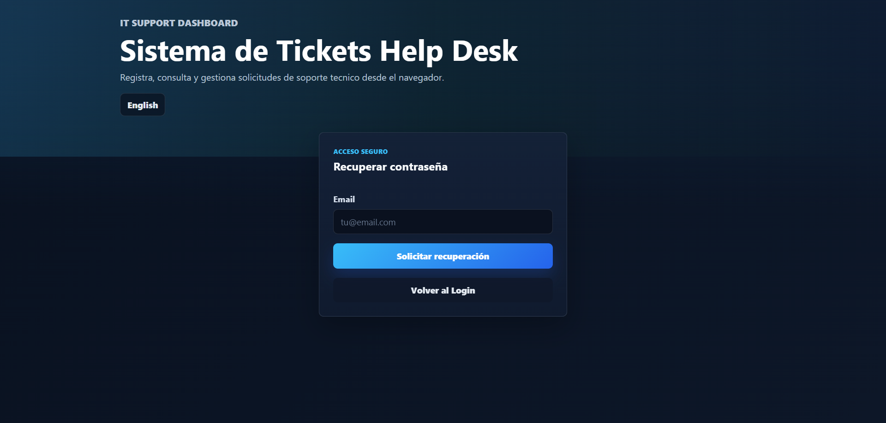

# Sistema de Tickets Help Desk

Idioma: [Español](README_ES.md) | [English](README.MD)

Sistema profesional de gestión de tickets Help Desk creado como proyecto de portafolio para roles de IT Support, Help Desk, Database Support y Junior Developer.

La aplicación permite que usuarios autenticados creen y den seguimiento a tickets de soporte, mientras que los administradores pueden gestionar tickets, usuarios, solicitudes de recuperación de contraseña, notificaciones y reportes profesionales en PDF/Excel usando datos reales de SQL Server.

## Funcionalidades

- Autenticación de usuarios con sesiones.
- Control de acceso por roles `Admin` y `User`.
- Creación de tickets vinculados al usuario autenticado.
- Fecha y hora de creación automática desde SQL Server.
- Prioridad del ticket: `Alta`, `Media`, `Baja`.
- Estado del ticket: `Abierto`, `En Progreso`, `Cerrado`.
- Admin puede crear, editar, cerrar y eliminar tickets.
- User puede crear tickets y ver la información permitida para su rol.
- Búsqueda de tickets por usuario o descripción del problema.
- Filtros de tickets por estado y prioridad.
- Contadores del dashboard para tickets abiertos, en progreso y cerrados.
- Panel de administración de usuarios.
- Almacenamiento seguro de contraseñas usando bcrypt.
- Flujo de solicitudes Forgot Password.
- Notificaciones para Admin sobre recuperación de contraseña y reportes.
- Exportación profesional de reportes PDF y Excel.
- Diseño dark theme responsive para desktop, tablet y móvil.

## Tecnologías Utilizadas

- HTML5
- CSS3
- JavaScript
- Node.js
- Express.js
- SQL Server
- mssql
- ExcelJS
- PDFKit

## Estructura del Proyecto

- `index.html`: estructura principal de la aplicación, login, tabs, tablas, formularios y modales.
- `style.css`: dark theme, diseño responsive, tarjetas, tablas, formularios, botones y estados visuales.
- `app.js`: lógica del frontend, llamadas API, traducciones, filtros, UI por roles y renderizado dinámico.
- `server.js`: backend con Express, conexión a SQL Server, autenticación, tickets, usuarios, notificaciones, forgot password y API de reportes.
- `seed.js`: crea usuarios, tickets y notificaciones demo sin duplicar datos.
- `README.md`: documentación del proyecto.

## Cómo Correr el Proyecto

1. Instalar dependencias:

```bash
npm install
```

Dependencias adicionales para exportar reportes:

```bash
npm install exceljs pdfkit
```

2. Correr seed data:

```bash
npm run seed
```

Este comando crea usuarios y tickets demo en SQL Server. Puede ejecutarse más de una vez porque evita duplicar los datos demo.

3. Iniciar el servidor:

```bash
npm start
```

o:

```bash
node server.js
```

4. Abrir la aplicación:

```text
http://localhost:3000
```

## Cuentas Demo

Admin:

```text
Email: admin@helpdesk.local
Password: Admin123!
```

User:

```text
Email: user@helpdesk.local
Password: User123!
```

## Login y Roles

El sistema usa autenticación basada en sesiones.

- `Admin`: puede crear, editar, cerrar y eliminar tickets. También puede administrar usuarios, ver solicitudes de Forgot Password, recibir notificaciones y generar reportes.
- `User`: puede iniciar sesión, crear tickets y ver la información permitida para su rol.

## Tickets

Los tickets se guardan en SQL Server y se asocian con la sesión del usuario autenticado.

Cada ticket incluye:

- Ticket ID.
- Descripción del problema.
- Prioridad.
- Estado.
- Fecha y hora de creación.
- Usuario que reportó el ticket.

La lista de tickets permite búsqueda en tiempo real y filtros por estado y prioridad.

## Administración de Usuarios

Los usuarios Admin pueden gestionar cuentas reales desde el tab `Usuarios`.

El panel de usuarios incluye:

- User ID.
- Nombre completo.
- Email.
- Rol.
- Fecha de creación.
- Información de auditoría sobre quién creó el usuario.

Los administradores pueden crear usuarios, editar usuarios, asignar roles, eliminar usuarios y configurar contraseñas temporales.

## Forgot Password

La pantalla de login incluye una opción `Forgot Password`.

Flujo:

1. El usuario abre la pantalla de recuperación de contraseña.
2. El usuario ingresa su email.
3. El sistema guarda la solicitud en SQL Server.
4. El sistema crea una notificación para Admin.
5. El usuario recibe un mensaje de confirmación.
6. La contraseña nunca se muestra públicamente.

Los administradores pueden revisar las solicitudes Forgot Password desde el tab `Usuarios`, en la sección `Solicitudes Forgot Password`.

Cada solicitud muestra:

- Nombre del usuario.
- Email.
- Fecha y hora de la solicitud.
- Estado: `Pendiente` o `Resuelto`.

Flujo recomendado para Admin:

1. El usuario envía una solicitud Forgot Password.
2. El Admin abre `Notificaciones` o `Usuarios`.
3. El Admin edita la cuenta del usuario.
4. El Admin asigna una nueva contraseña o contraseña temporal.
5. El Admin marca la solicitud como `Resuelto`.
6. La notificación queda como historial y deja de contar como nueva.

## Notificaciones para Admin

El sistema crea notificaciones para Admin cuando ocurren acciones importantes, incluyendo:

- Solicitudes Forgot Password.
- Actividad relacionada con tickets.
- Acciones de administración de usuarios.
- Generación y exportación de reportes.

Las notificaciones incluyen mensaje, tipo, fecha, estado y acción cuando aplica.

## Reportes

El tab `Reportes` está disponible solo para usuarios con rol `Admin`.

Este módulo genera reportes profesionales usando los tickets reales guardados en SQL Server. Si hay filtros aplicados, la exportación incluye solo los resultados filtrados. Si no hay filtros, la exportación incluye todos los tickets disponibles.

Filtros disponibles:

- Fecha desde.
- Fecha hasta.
- Estado.
- Prioridad.

Para filtrar un día exacto, usa la misma fecha en ambos campos. Por ejemplo, si seleccionas `2026-06-15` como fecha inicial y final, el sistema devuelve los tickets creados ese día.

Exportación de reportes:

- `Exportar PDF`: descarga un reporte PDF profesional con branding `WR Help Desk System`.
- `Exportar Excel`: descarga los mismos datos reales en una hoja organizada.

Los reportes incluyen:

- Fecha y hora de generación del reporte.
- Rango de fechas seleccionado.
- Filtros aplicados: estado y prioridad.
- Total de tickets.
- Estadísticas por estado: `Abiertos`, `En Progreso` y `Cerrados`.
- Estadísticas por prioridad: `Alta`, `Media` y `Baja`.
- Tabla con `ID`, `Problema`, `Prioridad`, `Estado`, `Fecha` y `Reportado por`.

Endpoints de reportes:

- `GET /api/reports/tickets`: devuelve datos filtrados del reporte en JSON.
- `GET /api/reports/tickets/pdf`: exporta el reporte a PDF.
- `GET /api/reports/tickets/excel`: exporta el reporte a Excel.

## Capturas de Pantalla

Capturas recomendadas para GitHub:

- Pantalla de Login: ideal para mostrar autenticación y una primera impresión profesional.
- Admin Dashboard: ideal para mostrar métricas, sesión por rol, tabs y notificaciones.
- User Dashboard: muestra la experiencia del usuario regular con sus tickets y notificaciones.
- Módulo Tickets: ideal para mostrar el flujo principal de Help Desk.
- Módulo Reportes: ideal para mostrar filtros, generación de reportes y opciones de exportación.
- Módulo Usuarios: ideal para mostrar administración de cuentas.
- Módulo Notificaciones: ideal para mostrar seguimiento de actividad administrativa.
- Forgot Password: muestra el flujo de recuperación de contraseña integrado al sistema.

Nombres de archivo sugeridos:

- `screenshots/login.png`
- `screenshots/admin-dashboard.png`
- `screenshots/user-dashboard.png`
- `screenshots/tickets-admin.png`
- `screenshots/reports.png`
- `screenshots/users-admin.png`
- `screenshots/notifications.png`
- `screenshots/forgot-password.png`

### Login



### Admin Dashboard



### User Dashboard

Muestra la experiencia del usuario regular con sus tickets y notificaciones.



### Tickets



### Reportes



### Administración de Usuarios



### Notificaciones



### Forgot Password

Muestra el flujo de recuperación de contraseña integrado al sistema.



## Diseño Responsive

La interfaz está diseñada para pantallas móviles, tablets y desktop.

- Los tabs se adaptan con scroll horizontal cuando es necesario.
- Los formularios usan ancho completo en pantallas pequeñas.
- Las tablas permiten scroll horizontal para conservar todas las columnas.
- Los botones tienen tamaño cómodo para interacción táctil.
- Login, dashboard, tickets, usuarios, reportes, notificaciones y forgot password mantienen el mismo dark theme.

## Base de Datos SQL Server

Configuración del backend:

- Server: `localhost`
- Database: `HelpDeskDB`
- Authentication: Windows Authentication

Tablas principales usadas por el sistema:

- `Tickets`
- `Users`
- `Notifications`
- `PasswordResetRequests`

Campos principales de tickets:

- `TicketID`
- `Description`
- `Priority`
- `Status`
- `CreatedAt`
- `CreatedByUserID`

Campos principales de usuarios:

- `UserID`
- `FullName`
- `Email`
- `Password`
- `Role`
- `CreatedAt`
- `CreatedByUserID`

## API Endpoints

Tickets:

- `GET /api/tickets`: devuelve tickets.
- `POST /api/tickets`: crea un ticket.
- `PUT /api/tickets/:id/close`: cierra un ticket.
- `DELETE /api/tickets/:id`: elimina un ticket.

Usuarios:

- `GET /api/users`: devuelve usuarios.
- `POST /api/users`: crea un usuario.
- `PUT /api/users/:id`: actualiza un usuario.
- `DELETE /api/users/:id`: elimina un usuario.

Autenticación y recuperación:

- `POST /api/login`: inicia una sesión.
- `POST /api/logout`: cierra una sesión.
- `GET /api/session`: devuelve la sesión autenticada.
- `POST /api/forgot-password`: crea una solicitud de recuperación de contraseña.
- `GET /api/password-resets`: devuelve solicitudes Forgot Password para Admin.
- `PUT /api/password-resets/:id/resolve`: marca una solicitud como resuelta.

Reportes:

- `GET /api/reports/tickets`: devuelve datos filtrados del reporte.
- `GET /api/reports/tickets/pdf`: exporta PDF.
- `GET /api/reports/tickets/excel`: exporta Excel.

## Conceptos Practicados

- HTML semántico.
- Layouts responsive con CSS.
- CSS Grid y Flexbox.
- Manipulación del DOM.
- Eventos en JavaScript.
- Integración REST API con `fetch`.
- Rutas con Express.
- Consultas SQL Server con `mssql`.
- Autenticación basada en sesiones.
- Autorización por roles.
- Hashing de contraseñas con bcrypt.
- Renderizado dinámico de tablas.
- Generación de PDF y Excel.
- Documentación profesional para GitHub.

## Autor

William Rosado Pérez

- B.S. Computer Science
- IT Support Specialist
- Database Support
- Puerto Rico

GitHub: [https://github.com/Puppywill](https://github.com/Puppywill)
